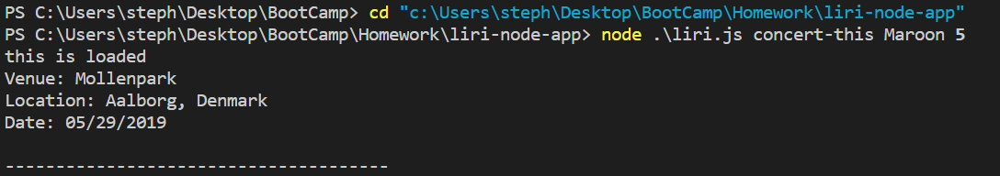
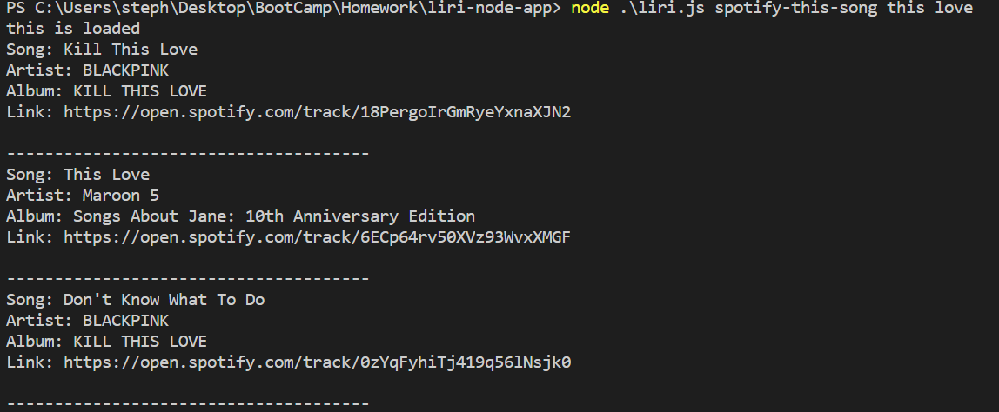

# liri-node-app
This app allows user to search through information for a song, a movie, or a concert.

Use concert-this follow with the artist name, it will return the most upcoming event information
for the specific artist.

Use spotify-this-song follow with the song name, it will return the song's artist, album, and 
its spotify URL

